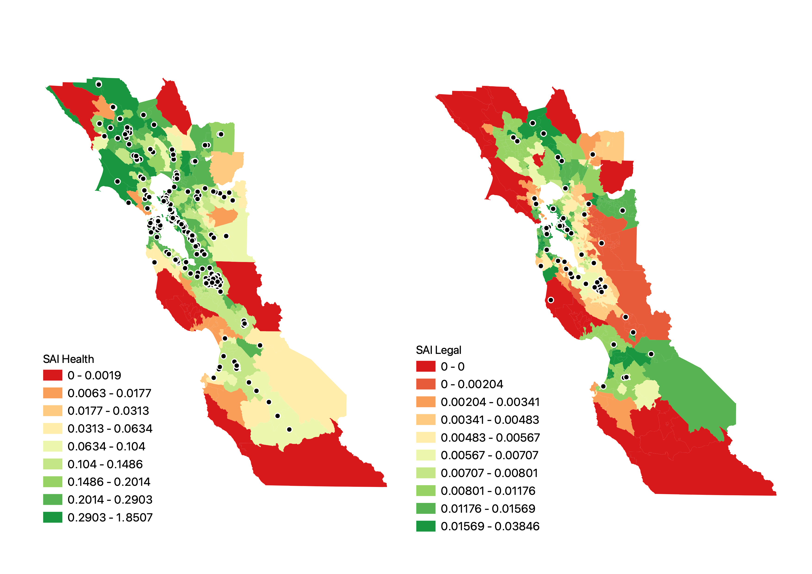

# Replication code for Roubenoff, Slootjes, and Bloemraad, Spatial and Sociodemographic Vulnerability: Quantifying Accessibility to Health Care and Legal Services for Immigrants in California, Arizona, and Nevada



This repository contains R code for replicating all figures and analysis.
We have deposited our data in the Harvard Dataverse (LINK). 
To replicate our results, follow the following instructions:

1) Clone this repository to your home directory.

2) Download all data from the Harvard Dataverse. The dataverse repository
contains two folders: `data` and `figs`. In this git repository
are two corresponding empty folders. To replicate our findings, 
you must copy the contents of both folders from the 
Dataverse files to the repository folders. 

3) To replicate our results, run files `01_calc_clinic_sj`, `02_bimi_index`, and `03_plots`.
Maps are generated using QGIS, and the corresponding project files are present in the 
dataverse repository.

# Important note about replication:

For this project, we calculated travel-time buffers around census tracts
and clinic locations. We used OpenStreetMap and the OpenSourceRoutingMachine
to do so. Replicating these buffers is not a trivial operation, so we 
have included the calculated buffers within the Dataverse repository `data` folder.

To replicate the buffers, you must first install OSM and OSRM following
the instructions on their respective websites. Then, extract the file `CANVAZ.osm.gz` 
in the dataverse folder `osm` and create a OSRM server instance.
The command for doing so is:

```
osrm-routed CANVAZ.osm
```

We recommend running this inside of a `tmux` instance.

Then, to calculate the buffers, run `00_load_clinic_catchment_areas` and `00_load_tract_catchment_areas`,
which will write the output to `data/`.
